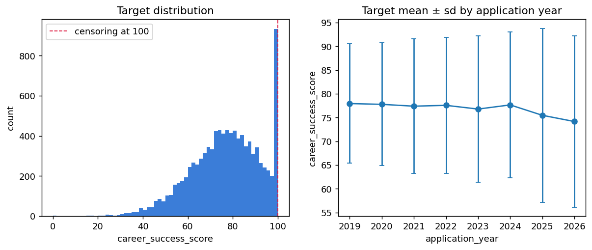
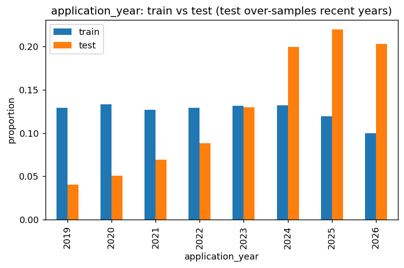
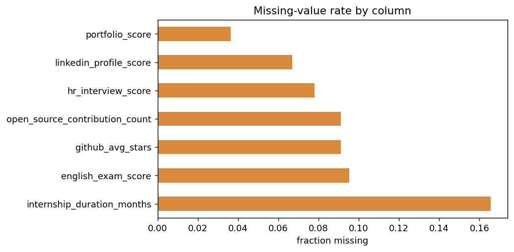
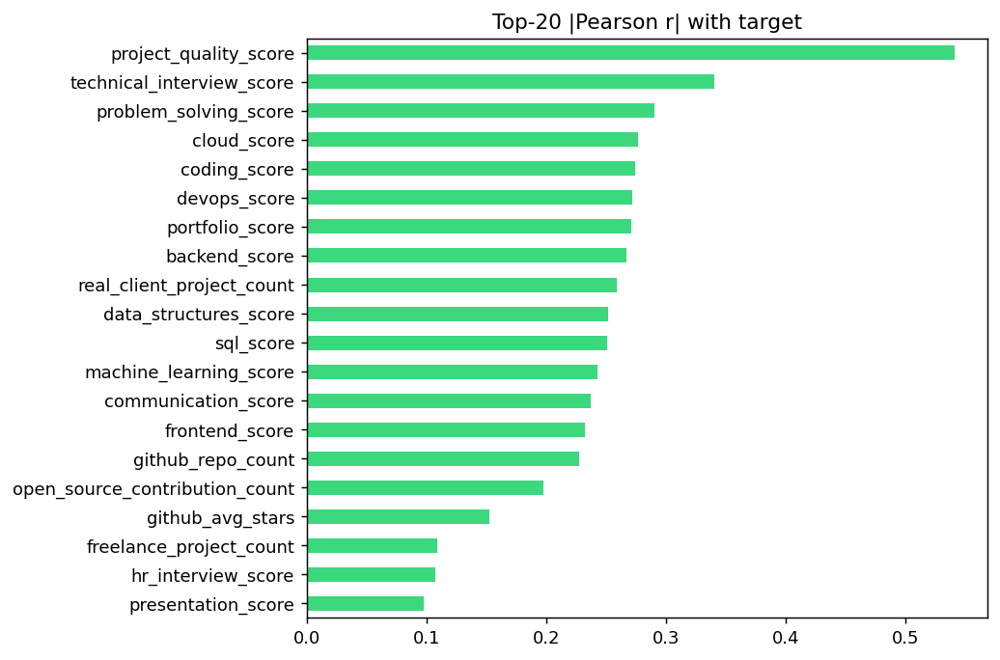
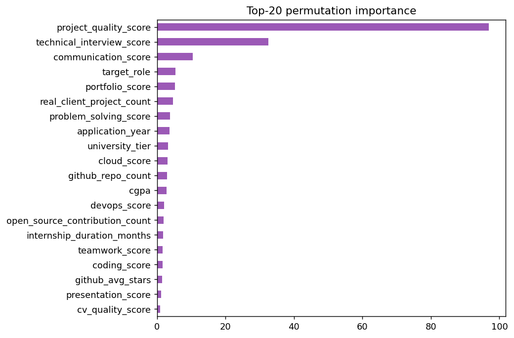
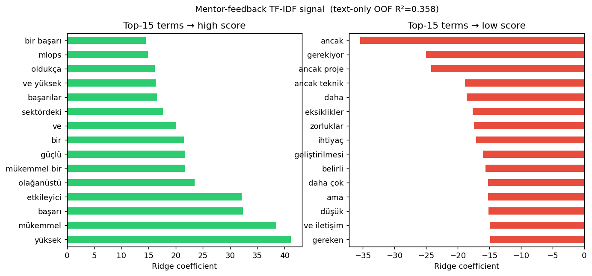
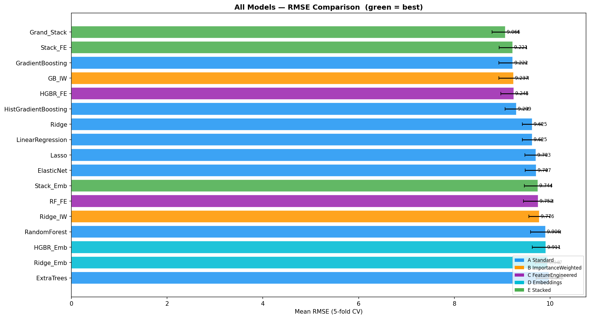
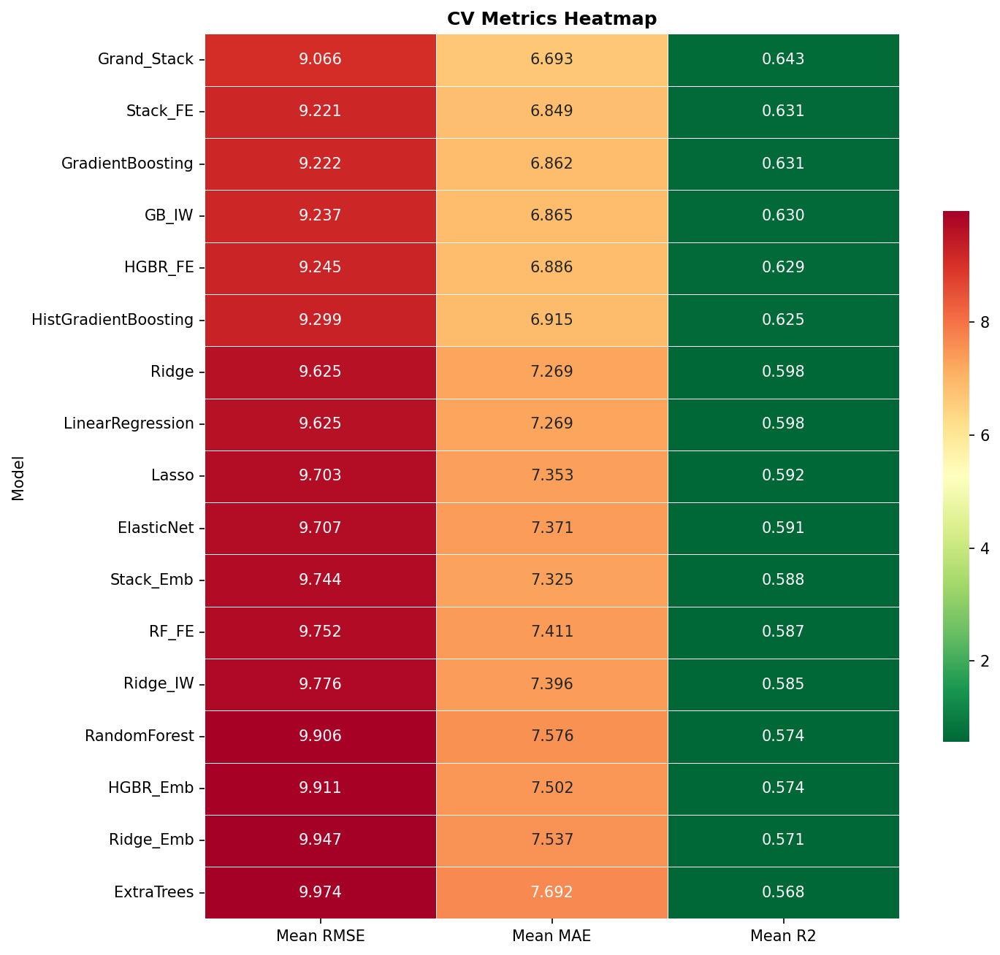
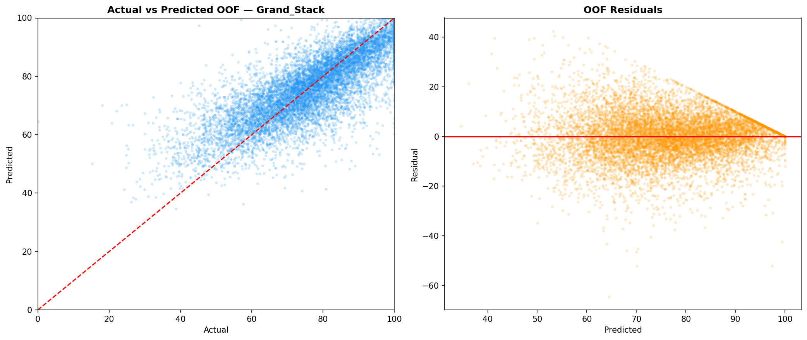

# Career Success Score — A Regression Pipeline for Censored, Shifted Tabular + Text Data

End-to-end machine-learning solution for predicting a continuous
`career_success_score` (bounded 0–100) from mixed tabular features and a
free-text *mentor feedback* field. The project is organised as a clean,
reproducible **core pipeline** plus a set of documented **advanced techniques**
that each target a specific, empirically identified property of the data.

**Author:** Dr. Ahmet Serdar Mutluer, MD · **Competition:** Datathon 2026

**Final result:** private leaderboard **83.75** / public **82.89** MSE
(baseline "predict the mean" ≈ 230.6; i.e. **R² ≈ 0.69** on the true,
held out private split).

---

## 1. Problem and data

- **Task:** regression; minimise Mean Squared Error.
- **Rows:** 10,000 train / 10,000 test; ~45 predictors.
- **Predictor families:** academic (cgpa, attendance, exam scores), technical
  skills (coding, SQL, ML, cloud, …), experience (internships, projects),
  portfolio (GitHub, LinkedIn, CV), interview and soft skill scores, plus
  categoricals (department, university tier, target role) and one Turkish
  free text column, `mentor_feedback_text`.
- **Three properties that shaped every modelling decision** (see `eda.py`):
  1. **Upper censoring** : the target is capped at 100 and ~7.7 % of rows sit
     at exactly 100 (a ceiling effect, analogous to an assay saturating at its
     limit of detection).
  2. **Distribution shift** : the test set over samples recent application
     years (2024–2026), where the target is lower and noisier
     (adversarial train-vs-test AUC ≈ 0.64).
  3. **Informative missingness** : missing values (e.g. no GitHub profile)
     correlate with a lower target, so *missingness itself is signal*.

---

## 2. Exploratory data analysis

Reproducible via `python eda.py` (writes to `figures/`). The analysis is
deliberately organised around the three data properties above, because each one
dictated a specific modelling choice.

**Target distribution & temporal drift.** The outcome is left skewed with a
hard ceiling at 100; recent application years have a lower, noisier target.
This motivated the two part (hurdle) model and the year-weighted objective.



**Distribution shift (train vs test).** The test set systematically
over-samples recent years (adversarial train-vs-test AUC ≈ 0.64), so the
offline objective is weighted by the per-year test/train density ratio.



**Informative missingness.** Missingness is concentrated in a few
profile/interview columns and correlates with a *lower* target — i.e. the act
of a value being missing is itself predictive, so missing indicators are kept
as features rather than silently imputed away.



**Signal ranking.** Linear correlation and (non linear) permutation importance
agree that `project_quality_score` dominates, followed by the interview and
communication scores; classic academic metrics (cgpa, attendance) carry almost
no signal; which directly shaped the importance weighted feature engineering.




**Mentor-feedback text signal.** The free-text `mentor_feedback_text` column
(Turkish, ~274 chars on average) was evaluated in isolation using a TF-IDF
vectoriser (unigrams + bigrams, 20 k features) paired with a Ridge regression
meta learner in a 5 fold cross validation. The text alone explains **36 % of
target variance** (OOF R² = 0.358), confirming that the mentor's wording carries
real predictive information beyond the numeric and categorical predictors.
The figure below shows the 15 TF-IDF terms with the largest positive Ridge
coefficients (associated with *higher* career success scores, shown in green) and
the 15 with the most negative coefficients (associated with *lower* scores, shown
in red). Phrases related to leadership, strong technical proficiency, and proactive
attitude cluster on the positive side, while terms indicating limited experience or
concerns about performance appear on the negative side; a pattern that directly
informed the text feature engineering strategy.



---

## 3. Repository layout

```
config.py              all paths, columns, CV / weighting / budget settings
utils.py               seeding, stratified folds, year-weights, metrics, tracking
eda.py                 reproducible EDA → figures/ + console report
feature_engineering.py tabular features + leakage-safe nested target encoding
text_features.py       TF-IDF + sentence-embeddings + lexicon text features
model_training.py      6 model adapters (CatBoost/LGBM/XGB/ExtraTrees/HistGB/MLP) + Optuna HPO
ensemble.py            blending + stacking with an honest CV-over-OOF referee
evaluation.py          ablations, imputation comparison, SHAP interpretation
train.py               orchestrates the full core pipeline → submission.csv
inference.py           artifacts + a test CSV → submission.csv
advanced/              the four techniques that took the score from ~84 to 83.75
  two_part_censored.py   hurdle model for the censoring at 100
  feature_pruning.py     model-specific feature selection (helps NN, not GBDTs)
  tabpfn_column.py       TabPFN foundation-model stack column
  finetune_bert.py       fine-tuned Turkish BERT on the mentor text
  README.md              how the advanced columns combine
prompts/               the original task prompts (EDA brief + modelling spec)
data/                  train.csv / test_x.csv / sample_submission.csv (included)
figures/               EDA output figures
```

---

## 4. Quickstart

```bash
python -m venv .venv && source .venv/bin/activate
pip install -r requirements.txt
# macOS: a single OpenMP runtime avoids a LightGBM/torch segfault
#   brew install libomp

# the dataset is already included under data/ (train.csv, test_x.csv)
python eda.py                 # exploratory analysis → figures/
python train.py --budget fast # core pipeline → submission.csv  (use 'full' for the real run)
```

> The original task prompts — the Exploratory-Data-Analysis brief and the full
> modelling specification — are preserved verbatim in `prompts/`.

`train.py --budget {smoke,fast,full}` scales the hyper-parameter search so the
same code path serves a 5-minute sanity check and the full run.

---

## 5. Methodology

### 5.1 Core pipeline (`train.py`)

1. **Feature engineering** : domain aggregates (academic/technical/interview
   strength), role conditional skill alignment, efficiency ratios, curated and
   automated interactions, missing value indicators, ordinal/frequency/
   **leakage-safe nested target encoding** of categoricals.
2. **Text features** : TF-IDF (word 1–3 grams + character n-grams, suited to
   agglutinative Turkish) reduced by Truncated SVD, multilingual sentence
   embeddings reduced by PCA, lexicon/shape statistics, and nested
   meta model predictions that compress the text into a few strong columns.
3. **Six base models** : CatBoost, LightGBM, XGBoost, ExtraTrees,
   HistGradientBoosting, and a torch MLP with categorical embeddings; each
   tuned with Optuna and given a model appropriate missing value strategy
   (native NaN handling for the trees; imputation for the others).
4. **Distribution-shift correction** : all metrics, the HPO objective, and the
   stacker optimise a **year-weighted MSE**: each row is weighted by the
   density ratio `P_test(year) / P_train(year)`. This made the offline score a
   faithful proxy for the leaderboard (validated to ±0.15).
5. **Stacking with an honest referee** : base out of fold predictions are
   combined by a Ridge / convex-blend / shallow-CatBoost meta-model; the choice
   is made by **repeated CV *over the OOF rows***, never in-sample, so the most
   flexible combiner cannot win by overfitting.

### 5.2 Advanced techniques (`advanced/`)

Each was kept only after a **paired test on fresh, held out folds** confirmed a
statistically significant gain. Their measured contributions:

| Technique | Idea | Effect |
|---|---|---|
| **Two-part (hurdle) model** | predict `(1−p)·E[y\|y<100] + p·100`, with an isotonically-calibrated censoring classifier `p` | handles the spike at 100 that single loss regression bends toward |
| **TabPFN column** | a transformer pre-trained on synthetic tabular data, added as a decorrelated ensemble member | **largest single gain** (LB −0.5); over-delivered on the private split |
| **Fine tuned BERTurk** | a Turkish BERT regression head on the mentor text | text only R² 0.36→0.57; small but real in the stack |
| **Model specific feature pruning** | top-K permutation ranked features | helps noise sensitive models (NN −1.9 MSE) but **not** robust GBDTs |

### 5.3 What did *not* work (recorded honestly)

Importance weighted base training, blanket column deletion, pseudo-labeling,
naive top-K feature selection for GBDTs, additional TabPFN/NN ensemble members,
and FT-Transformer were each tried and **rejected by the referee** : a
flexible model can memorise the training set (in-sample R² 0.996) yet generalise
to only R² ≈ 0.68, so the remaining error is largely irreducible label noise
(near-identical students differ by ~13 points). Every model family contributes
exactly **one** useful stack column.

---

## 6. Results

| Stage | Public MSE | Private MSE |
|---|---|---|
| Plain unweighted ensemble | 84.88 | 84.98 |
| + two part + year weighting | 84.09 | 84.93 |
| + noise column removal | 83.96 | 84.87 |
| + TabPFN + fine tuned BERT | 82.89 | 84.20 → |
| **+ feature pruned NN (final)** | **82.89** | **83.75** |

The best public submission is also the best private one: the year weighted,
honestly validated optimisation transferred faithfully to the hidden split
(private ≈ public + ~0.85, a stable offset with the ranking preserved).

**Model comparison (RMSE).** All six base models were evaluated under a 5 fold
cross validation with year-weighted MSE. The chart ranks them by out of fold
RMSE, making it straightforward to see which families contribute unique signal
and which are redundant before stacking.



**Cross validation stability.** The heatmap shows each model's fold level RMSE,
revealing whether a model's average performance is driven by one lucky fold or
is genuinely consistent across the five splits. Stable models (low row variance)
are preferred stack members.



**Best model: OOF predictions vs actuals.** The scatter plot of out of fold
predictions against ground truth scores for the best single model illustrates
where residual error concentrates; particularly near the censoring boundary
at 100, motivating the two part hurdle model described in §5.2.



---

## 7. Engineering principles

- **Honest validation above all** : every decision is gated by an out of fold,
  shift-weighted, paired significance test; nothing ships on an in sample gain.
- **Reproducibility** : a single random seed drives folds, models, the Optuna
  sampler, and torch; `inference.py` reproduces the submission from saved
  artifacts.
- **Diagnose before modelling** : censoring, shift, and the noise floor were
  measured first and each mapped to a specific technique.

## 8. Honest limitations

The generalisable signal ceiling for these features is R² ≈ 0.68; the solution
sits at ~0.69. Reaching the very top of the leaderboard would require signal
outside the provided features (e.g. an insight into the synthetic data-
generating process), not additional modelling on the given inputs.

---

*Built with Python, scikit-learn, CatBoost / LightGBM / XGBoost, PyTorch,
sentence-transformers, TabPFN, and Optuna.*
